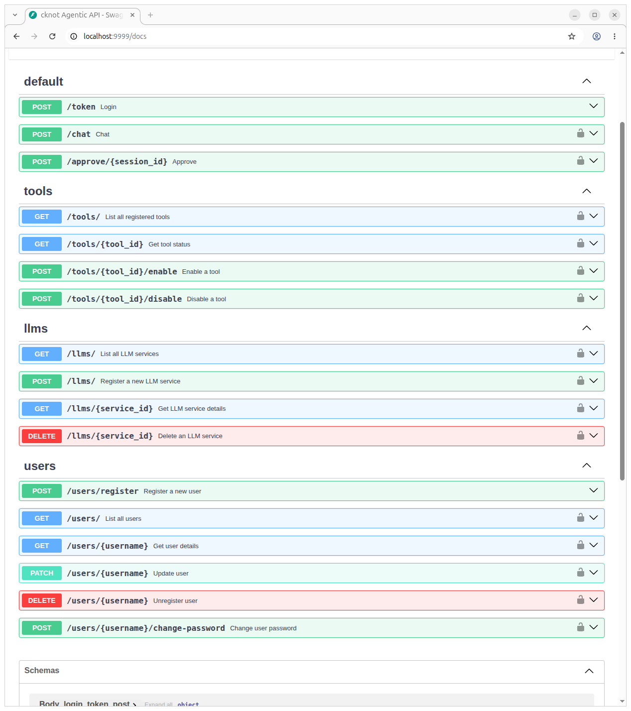
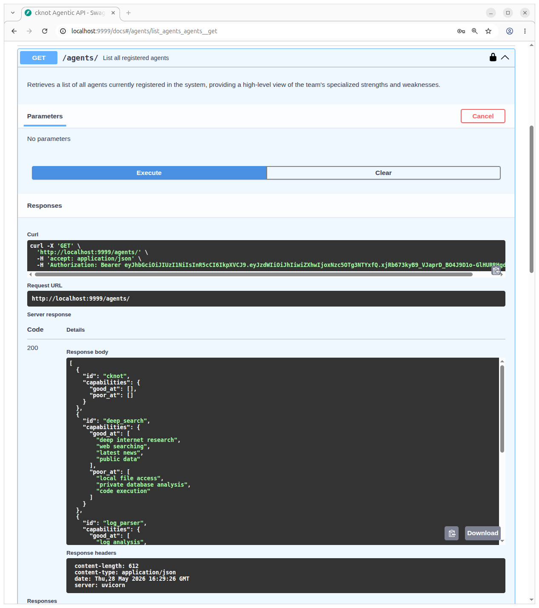

# 🪢 CKnot (Chinese Knot Orchestrator)

**CKnot** is a cutting-edge agentic workflow orchestration framework built with Python, LangGraph, and FastAPI. Inspired by the intricate and interconnected nature of a Chinese Knot, the project coordinates multiple specialized agents under a central "Boss" orchestrator to handle complex system debugging and general assistance tasks.

## ✨ Key Features

-   **Hierarchical Multi-Agent System**: A central "Boss Agent" (`cknot`) delegates tasks to specialized agents like the `Deep Search`, `Log Parser` and `Code Fixer`.
-   **Interactive Rich CLI**: A professional terminal interface featuring Markdown rendering, live status spinners, and a hierarchical slash-command registry (`/llms`, `/agents`, `/status`, etc.).
-   **Persistent State Management**: Full conversation persistence using Redis-backed LangGraph checkpointing, allowing workflows to survive restarts and handle human-in-the-loop interruptions.
-   **Dynamic LLM Service Registry**: Register, enable, and switch between multiple LLM providers (OpenAI, local vLLM, etc.) at runtime without code changes.
-   **Production-Grade Logging**: Sophisticated logging featuring sensitive data redaction (API keys/passwords) and dynamic routing of logs to user-specific files.
-   **Telemetry & Cost Tracking**: Built-in tracking of token consumption and estimated costs per agent turn.
-   **Modern Tooling**: Powered by `uv` for lightning-fast dependency management and containerized with Docker/Podman support.

## 🚀 Getting Started

### Prerequisites
- Docker or Podman
- `uv` (recommended for local development)

### Quick Start

1.  **Initialize the project**:
    ```bash
    ./bootstrap.sh init
    ```

2.  **Configure environment**:
    Update the `.env` file in the root with your LLM provider details and Redis configuration.

3.  **Build and start the API server**:
    ```bash
    ./bootstrap.sh build
    ./bootstrap.sh start
    ```

4.  **Enter the Interactive CLI**:
    ```bash
    ./bootstrap.sh cli
    ```

## 🛠 CLI Slash Commands

The interactive CLI supports a hierarchical command system. Type `/help` inside the CLI turn to see all available options:

```
   ____ _  __ _   _  ___ _____ 
  / ___| |/ /| \ | |/ _ \_   _|
 | |   | ' / |  \| | | | || |  
 | |___| . \ | |\  | |_| || |  
  \____|_|\_\|_| \_|\___/ |_|  
version 0.0.1-alpha

───────────────────────────────────────────────────────────────────────────────────────────────────────────────────────────
cknot Interactive CLI (Session: cli_session_1779982985)
Type /exit or /quit to end the session.

───────────────────────────────────────────────────────────────────────────────────────────────────────────────────────────
You > /agents
───────────────────────────────────────────────────────────────────────────────────────────────────────────────────────────
───────────────────────────────────────────────── Active Agents in Graph ──────────────────────────────────────────────────
- cknot        LLM: default-llm (default) → Boss Orchestrator
- log_parser   LLM: default-llm (default) → Log Analysis Specialist
- code_fixer   LLM: default-llm (default) → Remediation specialist
- deep_search  LLM: default-llm (default) → Deep Research & Analysis
- tools        LLM: default-llm (default) → Tool Execution Engine
───────────────────────────────────────────────────────────────────────────────────────────────────────────────────────────
───────────────────────────────────────────────────────────────────────────────────────────────────────────────────────────
You > /llms
───────────────────────────────────────────────────────────────────────────────────────────────────────────────────────────
                             Registered LLM Services                              
┏━━━━━━━━━━━━━┳━━━━━━━━━━┳━━━━━━━━━━━━━━━━━━━━┳━━━━━━━━━┳━━━━━━━┳━━━━━━━━━━━━━━━━┓
┃ ID          ┃ Provider ┃ Model              ┃ Status  ┃ Valid ┃ Usage (In/Out) ┃
┡━━━━━━━━━━━━━╇━━━━━━━━━━╇━━━━━━━━━━━━━━━━━━━━╇━━━━━━━━━╇━━━━━━━╇━━━━━━━━━━━━━━━━┩
│ local-vllm  │ vllm     │ Qwen/Qwen3-0.6B    │ ENABLED │   ✔   │          0 / 0 │
│ default-llm │ ollama   │ my-qwen-3.6:latest │ ENABLED │   ✔   │    2449 / 2028 │
└─────────────┴──────────┴────────────────────┴─────────┴───────┴────────────────┘
───────────────────────────────────────────────────────────────────────────────────────────────────────────────────────────
You > /llms
             list    Lists all registered LLM services and their health status.  
             add     Interactively registers a new LLM service.
             rm      Removes an LLM service by ID.               
             test    Runs a connectivity check for an LLM service.
             load    Loads LLM services from a JSON or YAML file.
             enable  Enables an LLM service.   
```

```
cknot Interactive CLI (Session: cli_session_1780237934)
Type /exit or /quit to end the session.

───────────────────────────────────────────────────────────────────────────────────────────────────────────────────────────
You > /agents info DeepSearchAgent
───────────────────────────────────────────────────────────────────────────────────────────────────────────────────────────
╭──────────────────────────────────────────────── Agent: DeepSearchAgent ─────────────────────────────────────────────────╮
│ Name: DeepSearchAgent                                                                                                   │
│ Good at: deep internet research, web searching, latest news, public data                                                │
│ Poor at: local file access, private database analysis, code execution                                                   │
│ Policy: first                                                                                                           │
│ LLMs: None                                                                                                              │
│ Tools: web_search                                                                                                       │
╰─────────────────────────────────────────────────────────────────────────────────────────────────────────────────────────╯
───────────────────────────────────────────────────────────────────────────────────────────────────────────────────────────
You > /agents llm set DeepSearchAgent default-llm
───────────────────────────────────────────────────────────────────────────────────────────────────────────────────────────
✔ Assigned default-llm to DeepSearchAgent
───────────────────────────────────────────────────────────────────────────────────────────────────────────────────────────
You > search for the latest advancements and breakthroughs in AI technology today
───────────────────────────────────────────────────────────────────────────────────────────────────────────────────────────
I am delegating this request to the DeepSearchAgent, as it specializes in retrieving the latest news and conducting deep   
internet research.                                                                                                         

TRIGGER_DEEP_SEARCH                                                                                                        
╭──────────────────────────────────────────────────── Action Required ────────────────────────────────────────────────────╮
│ The agent is requesting to execute: deep_search                                                                         │
╰─────────────────────────────────────────────────────────────────────────────────────────────────────────────────────────╯
Authorize execution? (yes/no): yes
╭──────────────────────────────────────────────────── Action Required ────────────────────────────────────────────────────╮
│ The agent is requesting to execute: tools:                                                                              │
│   • web_search({'query': 'latest AI breakthroughs and advancements 2025'})                                              │
│   • web_search({'query': 'new AI models and frameworks released 2024 2025'})                                            │
│   • web_search({'query': 'AI industry trends and major news today'})                                                    │
│   • web_search({'query': 'breakthroughs in artificial intelligence research 2025'})                                     │
╰─────────────────────────────────────────────────────────────────────────────────────────────────────────────────────────╯
Authorize execution? (yes/no): yes
Based on the latest research publications, industry reports, and major model releases (late 2025–2026 timeframe), AI       
technology is undergoing a rapid pivot from passive generative systems toward highly autonomous, efficient, and vertically 
integrated architectures. Here are the most significant breakthroughs and advancements:                                    

🔹 Next-Generation Foundation Models                                                                                       

 • GPT-5 & The New Reasoning Tier: The GPT-5 launch series has shifted the baseline for chain-of-thought reasoning,        
   enabling models to tackle open-ended, multi-constraint problems with significantly fewer hallucinations.                
 • Google's Gemini 3 / Gemma 3 Ecosystem: Google has introduced tighter integration across reasoning, vision, and audio    
   modalities. Their open-weight Gemma 3 family has accelerated academic and commercial experimentation.                   
 • GLM-5 / GLM-5.1 Advancements: Chinese model architectures have posted leading benchmark scores (~92.7% on AIME 2025     
   mathematical reasoning), with GLM-5.1 specifically refined for production-grade code generation and software engineering
   workflows.                                                                                                              

🤖 Agentic AI & Autonomous Workflows                                                                                       

 • AI has transitioned from content generation to task execution. Modern frameworks now support long-horizon planning,     
   persistent memory, and secure tool-use APIs, allowing models to autonomously navigate software environments, run        
   scientific simulations, or manage enterprise pipelines.                                                                 
 • Multi-Agent Orchestration: Systems are being deployed where specialized agents (coder, researcher, validator, deployer) 
   collaborate in real-time, dramatically reducing human-in-the-loop latency.                                              

⚡ Hardware, Efficiency & Architecture                                                                                     

 • Neuromorphic & Quantum-Inspired Computing: Breakthrough silicon architectures are mimicking biological neural pathways, 
   cutting inference costs and latency for specialized workloads. Hybrid quantum-classical algorithms are also emerging for
   optimization and molecular modeling.                                                                                    
 • Sovereign & Edge AI: On-device/server hybrid models (e.g., Apple Intelligence, Apple Silicon optimizations, regional AI 
   clouds) prioritize privacy, compliance, and real-time responsiveness without sacrificing capability.                    

🔬 Scientific & Cross-Domain Integration                                                                                   

 • Autonomous Scientists: AI now designs experiments, interprets peer-reviewed literature, and suggests novel materials or 
   drug compounds, compressing R&D cycles in biotech, chemistry, and aerospace.                                            
 • Stanford AI Index 2025 Tracking: The report highlights exponential growth in AI patents, academic publications, and     
   compute scaling, alongside rapid corporate integration into finance, healthcare, logistics, and defense infrastructure. 

🌍 Strategic & Governance Developments                                                                                     

 • Major bilateral AI coalitions (e.g., US-Japan, EU-US tech pacts) are standardizing interoperability and safety          
   benchmarks.                                                                                                             
 • Regulatory frameworks are shifting from reactive oversight to proactive guardrails, focusing on watermarking, model     
   transparency, and automated audit trails.                                                                               

These advancements collectively signal maturity in reasoning depth, operational autonomy, and hardware efficiency. If you  
need a deep dive into a specific vector (e.g., agentic AI architecture, neuromorphic chip progress, regulatory compliance, 
or enterprise deployment strategies), let me know and I'll pull the targeted technical breakdown.                          
───────────────────────────────────────────────────────────────────────────────────────────────────────────────────────────
You > 
```


## 🛡 Security & Reliability

-   **Data Privacy**: The `RedactingFilter` automatically masks sensitive patterns like `api_key` or `password` in all system logs.
-   **State Isolation**: Conversations are isolated via `session_id`, ensuring multi-tenant safety.
-   **Health Checks**: The system performs pre-flight checks on Redis and LLM providers to ensure service availability before starting workflows.

## API Tests
1. Access the UI: Start your API server (./bootstrap.sh start) and navigate to http://localhost:9999/docs in your browser.

2. Authorize: Click the Authorize button at the top right. Use the /token endpoint credentials to unlock protected endpoints (indicated by the lock icon).

3. Test Orchestration:
   - Use the POST /chat endpoint to send a message like "Search for latest AI news".
   - If the response returns requires_action: true and next_node: "deep_search", use the POST /approve/{session_id} endpoint to authorize the specialist to run.

4. Audit Infrastructure: Expand the llms, tools, and users sections to review current system configurations, check token usage, or manage user profiles.




---
*Developed with passion for robust agentic orchestration.*
---